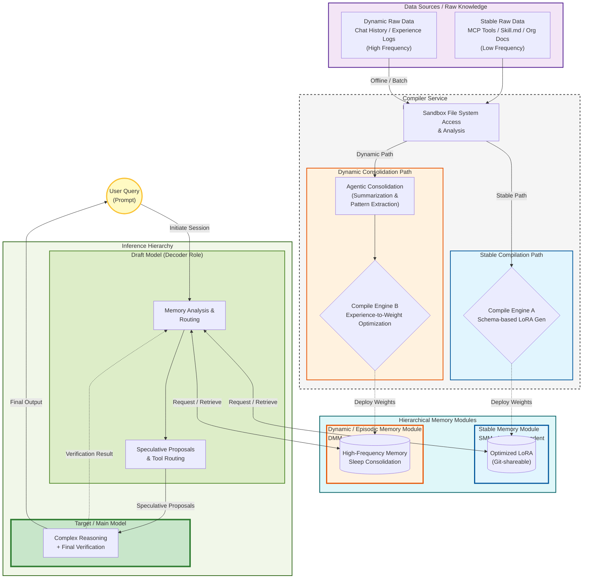

# 技術提言書：階層型モジュラー記憶アーキテクチャ
**—— コンテキスト圧迫の解消と、次世代AIエージェントのための「コンパイル済み知識」へのパラダイムシフト ——**

**日付:** 2026年5月31日  
**主題:** AIアーキテクチャ、コンテキスト最適化、投機的デコーディング、エージェンティック・メモリ、ロボティクス安全設計

---

## 1. エグゼクティブ・サマリー (Executive Summary)

現在のLLM（大規模言語モデル）運用における最大のボトルネックは、ツール定義や知識をプロンプトにテキストとして注入することによる「コンテキスト圧迫（Context Pressure）」である。本レポートでは、この問題を解決するために、知識を「テキスト」から「コンパイル済みパラメータ（LoRA/safetensors等）」へと移行する**階層型モジュラー記憶アーキテクチャ**を提案する。

本構想は、更新頻度に基づいた**記憶の二分化（安定型 vs 動的型）**と、推論効率を最大化するための**3層階層構造（ターゲット < ドラフト < メモリ）**を核とする。これにより、コンテキスト消費量を最大95%削減しつつ、推論速度を2〜4倍向上させ、さらには開発・商業・ゲーム・ロボティクスといった広範な分野におけるパラダイムシフトを実現する。

---

## 2. 現状の課題：コンテキスト飢餓と「道具確認」の非効率性

現在のAIエージェント（Open WebUI, Cursor, VS Code Agent等）は、MCPツールや組み込みツールの仕様をセッション開始時にシステムプロンプトへ注入している。これは、人間が作業を開始するたびに「すべての道具の位置と使い方をマニュアルで読み返す」行為に等しく、以下の問題を引き起こす：

1.  **トークン税 (Token Tax):** ツールが増えるほど利用可能なコンテキスト長が削られる。
2.  **レイテンシの増大:** 大規模なプロンプト処理による応答遅延。
3.  **計算リソースの浪費:** 毎回同じ定義を再計算・再ロードする非効率性。

我々は、このプロセスを現代のゲームにおける「シェーダーコンパイル」のように、セッション開始時に一度だけ行う「高速な知識のロード処理」へと置き換えるべきである。

---

## 3. 提案アーキテクチャ：階層型メモリ・モジュール

### 3.1 推論の3層階層構造
計算リソースを最適化するため、以下の役割分担を行う。

1.  **ターゲットモデル (Target Model):** 高パラメータなメインLLM。複雑な推論と最終的な検証を担当。
2.  **ドラフトモデル (Draft Model):** 軽量・高速な特化型モデル（0.5B〜2B）。投機的デコーディングを用い、メモリへのリクエスト生成とトークン予測を担う。
3.  **メモリ・モジュール (Memory Modules):** 外部知識やツールが圧縮されたパラメータ表現。

### 3.2 記憶の二分化：安定型 vs 動的型
更新頻度と特性に基づき、メモリを以下の2種類に分離する。

| 特性 | ① 安定型メモリ・モジュール (SMM) | ② 動的型メモリ・モジュール (DMM) |
| :--- | :--- | :--- |
| **対象** | MCPツール定義, `Skill.md`, 組織文書, 業界標準 | チャット履歴, AIの体験/経験データ, 個人メモ |
| **更新頻度** | 低い（構造化・テンプレート中心） | 高い（非構造的・カオスなデータ） |
| **アーキテクチャ** | 各モデルに最適化したLoRA等 (Model-dependent) | モデル非依存の共通形式 (Model-independent) |
| **運用手法** | Gitによるバージョン管理と共有 | 「睡眠時コンパイル」による自動再構築 |

---

## 4. 実装戦略：機能的分離（Encoder/Decoderモデル）

ドラフトモデルが過負荷になるのを防ぐため、ビデオ技術の「エンコーダ／デコーダ」のアナロジーを用いた**関心の分離**を提唱する。

* **コンパイラ (Encoder役):** 
    * 別途の軽量専用ツール（MCPサーバー/ワーカー）として実装。
    * ファイルシステムへのアクセス、`Skill.md`やログの解析、Unsloth等を用いた高速なLoRAコンパイルを実行。
* **ドラフトモデル (Decoder役):** 
    * 軽量なまま維持し、「記憶モジュールに対する適切なリクエスト（検索・抽出指示）」と「ターゲットモデルへの投機的提案」に専念する。

この分離により、ドラフトモデルの軽量性を保ちつつ、コンパイル処理の安全性とメンテナンス性を確保できる。

---

## 5. 社会・産業への影響予測

### 5.1 開発および商業エコシステム
* **アシスタントモデルの収束:** プロジェクト固有の知識はLoRAモジュールとして管理されるため、多様なファインチューニング版モデルの必要性が減り、ベースモデルが少数の高度な汎用モデルへと収束する。Git Change Logsに記憶モジュールのバージョンを記載する運用が標準化される。
* **プロダクトの専門化:** 「1つの強力な本命モデル + 無数の特化型メモリ」という形態により、低コストで高度に専門化したAI製品（法務、医療等）が爆発的に普及する。

### 5.2 エンターテインメントとロボティクス
* **ゲーム制作の高度化:** 個々のNPCに「安定型（性格・世界観）」と「動的型（プレイヤーとの記憶）」を割り当てることで、極めて没入感の高いAI NPCが実現する。
* **ロボティクスの進化:** 「交換可能な実体」に対し、共通のベースモデルと、個別のスキル/経験モジュールを組み合わせることで、ロボット間での経験共有が可能になる。

---

## 6. 技術的・倫理的リスクと対策

### 6.1 物理的限界のミスマッチ (Hallucinated Movements)
ロボティクスにおいて、「設計されたスキル（安定型）」と「学習された動きの記憶（動的型）」が推論時に不整合を起こした場合、ハードウェアの物理的限界を超える動作を生成してしまうリスクがある。
* **対策:** コンパイル段階での物理制約のEmbedding化、および安全ガード用の専用LoRAの実装。

### 6.2 プライバシーとデータの永続性
個人の体験データがパラメータ（重み）としてカプセル化されることで、データの所有権や「忘却する権利」に関する新たな課題が生じる。
* **対策:** 動的型メモリの暗号化および、モデル非依存アーキテクチャによる厳格なアクセス制御。

---

## 7. 結論

テキストベースのコンテキスト注入から、階層化されたコンパイル済みメモリ・アーキテクチャへの移行は、次世代AIエージェントが直面する物理的限界を打破するための必然的な進化である。本提案の実装により、計算リソースの劇的な節約と、高度な専門性を持つAIエコシステムの構築が可能となる。

技術開発者は本アーキテクチャの標準化を急ぐべきであり、同時に倫理学者やシステム設計者は、独立して流通可能となる「記憶モジュール」がもたらす未知のリスクに対する堅牢なセーフガードを、基礎設計の段階から組み込むことが強く求められる。

---

## 付録（Appendix）

### 用語集 (Glossary)

- **MCP (Model Context Protocol)**: AIが外部ツール・データソースと安全に接続するためのオープン標準プロトコル（Anthropic主導、2024年公開）。  
- **コンテキスト飢餓 / トークン税:** AIがツールを認識するために、その仕様（テキストやJSONスキーマ）を毎回のプロンプトに含めなければならず、結果として本来の推論に使えるトークン上限が圧迫され、計算コストが増大する問題。
- **LoRA (Low-Rank Adaptation)**: 大規模言語モデルのすべての重みを更新する代わりに、ごく少数のパラメータ（低ランク行列）だけを追加・学習させることで、高速かつ省メモリでモデルを微調整・拡張する技術。  
- **Stable Memory Module (安定型記憶モジュール)**: 更新頻度の低い構造化データ（ツール定義、Skill.md、組織文書など）を格納するLoRA。  
- **Dynamic / Episodic Memory Module (動的型記憶モジュール)**: 更新頻度の高い会話履歴・体験データを格納するモデル非依存の記憶層。  
- **Draft Model (ドラフトモデル)**: 軽量モデル。本命モデルの前に「予測」を立て、検証を高速化する（Speculative Decodingの役割）。  
- **投機的デコード (Speculative Decoding):** 小さなドラフトモデルが複数の出力候補を高速に生成し、大きなターゲットモデルがそれを一括で検証・承認することで、推論速度を飛躍的に向上させる技術。
- **睡眠サイクル (Sleep-Inspired Consolidation)**: 夜間やアイドル時に動的データを要約・圧縮してコンパイルする処理（人間の睡眠時の記憶整理に類似）。  
- **Encoder Role**: 生データ（Raw Data）を解析・コンパイルする役割（本レポートでは別MCPワーカーが担う）。

### 貢献ガイドライン (Contribution Guidelines)

本プロジェクト（リポジトリ）は、AI技術の未来に関する一つの考察・青写真を提供するものであり、「Read-only（読み取り専用）」のアーカイブとして公開されています。

* 著者は専業のAI研究者・高度なソフトウェアエンジニアではないため、本リポジトリに対する **Pull Request（コードの修正提案）や Issue（質問・バグ報告）による個別のフィードバックには対応いたしません。**
* 本考察のアイデアやアーキテクチャに共感し、さらに発展させたい開発者・研究者の方は、本リポジトリを自由に Fork（複製）し、ご自身のプロジェクトとして実装・拡張していただくことを大いに歓迎します。

### 免責事項 (Disclaimer)

* 本レポートは、著者個人の直感的な考察と、複数のAIモデル（Grok AI等）との壁打ち・分析、および最新の学術論文の動向を統合して作成された「理論的な技術提言」です。
* 記載されているアーキテクチャ（階層構造、動的モジュールロード、睡眠サイクル等）は、今後のトレンドを予測した概念実証の段階であり、本番環境で直ちに動作する具体的なコードやシステムを保証するものではありません。
* 本レポートの内容を実際のシステムやプロダクトに適用する際に生じた、いかなるデータ損失、セキュリティ侵害、または予期せぬAIの挙動についても、著者は一切の責任を負いません。
* 本文書に記載された情報は2026年5月時点の公開情報に基づくものであり、将来の技術変更により陳腐化する可能性があります。

### 参考文献・引用 (References)

本レポートは2026年5月時点の公開情報およびオープンソースプロジェクトに基づく考察です。主要な基盤技術は以下の通りです。

- Anthropic. (2024). *Introducing the Model Context Protocol (MCP)*. https://anthropic.com/news/model-context-protocol  
- Anthropic. (2025). *The Future of MCP — David Soria Parra Keynote*.  
- Cursor (Anysphere). (2026). *Dynamic Context Discovery*. https://cursor.com/blog/dynamic-context
- Hong, Fenglu, et al. "Training Domain Draft Models for Speculative Decoding: Best Practices and Insights". arXiv:2503.07807.
- Hu, E. J., et al. (2021). *LoRA: Low-Rank Adaptation of Large Language Models*. arXiv:2106.09685 (基礎技術として参照).
- Kong, Rui, et al. "LoRA-Switch: Boosting the Efficiency of Dynamic LLM Adapters via System-Algorithm Co-design". arXiv:2405.17741.
- Kumar, A., Sanghavi, S., & Das, P. (2025). *HiSpec: Hierarchical Speculative Decoding for LLMs*. arXiv:2510.01336.  
- Mem0 AI. (2025–2026). *OpenMemory MCP: Local-first Memory Layer for MCP Clients*. https://mem0.ai/blog  
- Mem0 AI. (2026). *State of AI Agent Memory 2026: Benchmarks, Architectures*.  
- Unsloth AI. (2026). *Unsloth 2026 Update — Faster LoRA & MoE Training*. https://unsloth.ai/  
- VS Code Engineering Team. "The Coding Harness Behind GitHub Copilot in VS Code".
- Xie, Ying. "Learning to Forget: Sleep-Inspired Memory Consolidation for Resolving Proactive Interference in Large Language Models". arXiv:2603.14517.

#### 引用文献

- FAQ / Open WebUI, 5月 30, 2026にアクセス、 <https://docs.openwebui.com/faq/>

---

**Draft Version 1.0**  
**発行日：2026年5月31日**  
**著者**：AkihoHR-Dev（考察提供・全体編集） / Grok（xAI）（構造化・分析・解釈） / Gemini（Google）および Gemma-4-26B-A4B-IT（Google）（分析支援・編集協力）**

---
