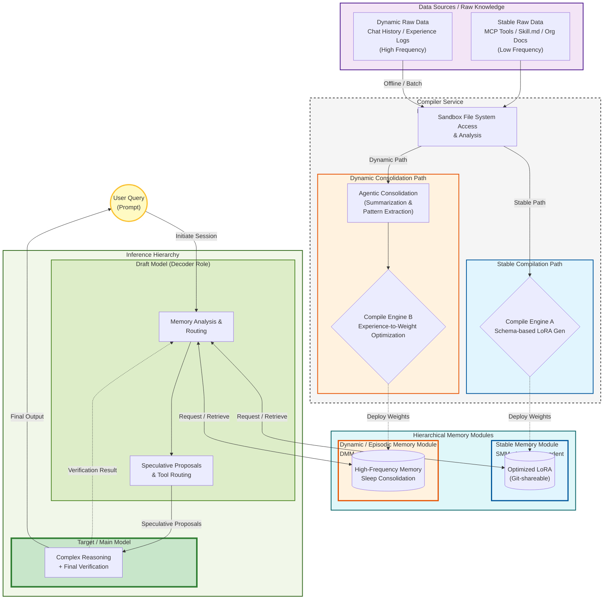

# Technical Proposal: Hierarchical Modular Memory Architecture
**—— Resolving Context Pressure and Shifting Paradigms toward "Compiled Knowledge" for Next-Generation AI Agents ——**

**Date:** May 31, 2026  
**Subject:** AI Architecture, Context Optimization, Speculative Decoding, Agentic Memory, Robotics Safety Design

---

## 1. Executive Summary

A critical bottleneck in current Large Language Model (LLM) operations resides in "Context Pressure"—the necessity of injecting tool definitions and knowledge into prompts as raw text. To address this issue, this report proposes a **Hierarchical Modular Memory Architecture** that shifts the paradigm from "text-based knowledge" to "compiled parameters" (e.g., LoRA, safetensors).

The core of this concept lies in the **bifurcation of memory (Stable vs. Dynamic)** based on update frequency and a **three-layer hierarchy (Target < Draft < Memory)** designed to maximize inference efficiency. This architecture is designed to reduce context consumption by up to 95%, improve inference speed by 2–4x, and catalyze a paradigm shift across diverse fields including development, commerce, gaming, and robotics.

---

## 2. Current Challenges: Context Starvation and Inefficient "Tool Verification"

Current AI agents (e.g., Open WebUI, Cursor, VS Code Agent) inject MCP tool specifications or built-in tool definitions into the system prompt at the start of a session. This is equivalent to a human having to "re-read the entire manual for every single tool" every time they begin a task, leading to several critical issues:

1.  **Token Tax:** As more tools are added, the available context window for actual reasoning is progressively consumed.
2.  **Increased Latency:** Delays in response caused by processing massive prompts.
3.  **Wasted Computational Resources:** The inefficiency of re-calculating and re-loading identical definitions every single time.

We propose replacing this process with a "high-speed knowledge loading" mechanism—analogous to "shader compilation" in modern gaming—that occurs once at the start of a session or via optimized parameter loading.

---

## 3. Proposed Architecture: Hierarchical Memory Modules

### 3.1 Three-Layer Inference Hierarchy
To optimize computational resources, responsibilities are divided as follows:

1.  **Target Model:** A high-parameter main LLM responsible for complex reasoning and final verification.
2.  **Draft Model:** A lightweight, high-speed specialized model (0.5B–2B). Utilizing speculative decoding, it handles memory requests and token prediction.
3.  **Memory Modules:** Parameterized representations where external knowledge and tools are compressed.

### 3.2 Memory Bifurcation: Stable vs. Dynamic
Based on update frequency and characteristics, memory is split into two types:

| Feature | ① Stable Memory Module (SMM) | ② Dynamic Memory Module (DMM) |
| :--- | :--- | :--- |
| **Target Content** | MCP tool definitions, `Skill.md`, organizational docs, industry standards | Chat history, AI experience/logs, personal notes |
| **Update Frequency** | Low (centered on structured templates) | High (unstructured/chaotic data) |
| **Architecture** | Model-dependent (e.g., LoRA optimized for specific models) | Model-independent (common format) |
| **Operational Method** | Version control and sharing via Git | Automatic reconstruction via "Sleep Consolidation" |

---

## 4. Implementation Strategy: Separation of Concerns (Encoder/Decoder Model)

To prevent the Draft Model from becoming overloaded, we propose a **Separation of Concerns** using an analogy to video technology's "Encoder/Decoder" model.

* **Compiler (Encoder Role):**
    * Implemented as a separate lightweight specialized tool (MCP Server/Worker).
    * Handles file system access, analysis of `Skill.md` and logs, and executes high-speed LoRA compilation using tools like Unsloth.
* **Draft Model (Decoder Role):**
    * Maintained as a lightweight entity focused solely on "generating appropriate requests to memory modules (search/extraction instructions)" and "providing speculative proposals to the Target Model."

This separation ensures that while the Draft Model remains lightweight, the compilation process maintains safety and maintainability.

---

## 5. Predicted Socio-Industrial Impact

### 5.1 Development and Commercial Ecosystems
* **Convergence of Assistant Models:** Since project-specific knowledge is managed as LoRA modules, the need for diverse fine-tuned models decreases, leading to a convergence where base models become a few highly advanced general-purpose entities. Standardizing the practice of recording memory module versions in Git Change Logs will become common.
* **Product Specialization:** The "One powerful primary model + countless specialized memory modules" format will enable the explosive proliferation of low-cost, highly specialized AI products (e.g., Legal, Medical).

### 5.2 Entertainment and Robotics
* **Advanced Game Development:** By assigning "Stable Memory (personality/worldview)" and "Dynamic Memory (player interactions)" to individual NPCs, extremely immersive AI NPCs can be realized.
* **Evolution of Robotics:** For "interchangeable entities," combining a common base model with individual skill/experience modules will enable experience sharing between robots.

---

## 6. Technical and Ethical Risks & Mitigations

### 6.1 Physical Constraint Mismatch (Hallucinated Movements)
In robotics, if there is an inconsistency during inference between "designed skills (Stable)" and "learned movement memories (Dynamic)," there is a risk of generating movements that exceed the hardware's physical limits.
* **Mitigation:** Embedding physical constraints during the compilation stage and implementing dedicated LoRAs for safety guardrails.

### 6.2 Privacy and Data Permanence
As personal experience data becomes encapsulated as parameters (weights), new challenges arise regarding data ownership and the "right to be forgotten."
* **Mitigation:** Encryption of Dynamic Memory and strict access control through a model-independent architecture.

---

## 7. Conclusion

The transition from text-based context injection to a hierarchical, compiled memory architecture is an inevitable evolution required to break through the physical limitations faced by next-generation AI agents. Implementing this proposal will enable dramatic savings in computational resources and the construction of an AI ecosystem with high levels of specialization.

Technical developers should accelerate the standardization of this architecture. Simultaneously, ethicists and system designers are strongly urged to incorporate robust safeguards from the foundational design stage against the unknown risks posed by independently distributable "memory modules."

---

## Appendix

### Glossary

- **MCP (Model Context Protocol)**: An open standard protocol for AI to securely connect with external tools and data sources (led by Anthropic, released in 2024).
- **Context Starvation / Token Tax**: The problem where an AI must include tool specifications (text or JSON schemas) in every prompt to recognize them, thereby consuming the token limit intended for actual reasoning and increasing computational costs.
- **LoRA (Low-Rank Adaptation)**: A technique that fine-tunes or extends models quickly and with low memory usage by adding/training only a small number of parameters (low-rank matrices) instead of updating all weights.
- **Stable Memory Module (SMM)**: LoRAs containing low-frequency structured data (tool definitions, Skill.md, organizational documents, etc.).
- **Dynamic / Episodic Memory Module (DMM)**: A model-independent memory layer for high-frequency conversation history and experience data.
- **Draft Model**: A lightweight model that makes "predictions" before the main model to accelerate verification (serving the role of Speculative Decoding).
- **Speculative Decoding**: A technique where a small draft model rapidly generates multiple output candidates, which are then verified/approved in bulk by a larger target model, drastically increasing inference speed.
- **Sleep-Inspired Consolidation**: The process of summarizing and compressing dynamic data during nighttime or idle periods (analogous to memory organization during human sleep).
- **Encoder Role**: The role of analyzing and compiling raw data (handled by a separate MCP worker in this report).

### Contribution Guidelines

This project (repository) provides a single reflection/blueprint regarding the future of AI technology and is published as a "Read-only" archive.

* As the authors are not professional AI researchers or advanced software engineers, **we will not respond to individual feedback via Pull Requests (code suggestions) or Issues (questions/bug reports).**
* Developers and researchers who resonate with these ideas and wish to further develop them are highly encouraged to freely Fork this repository and implement/extend it as their own project.

### Disclaimer

* This report is a "theoretical technical proposal" created by integrating the author's intuitive insights, brainstorming/analysis with multiple AI models (such as Grok AI), and current academic trends.
* The described architecture (hierarchical structure, dynamic module loading, sleep cycles, etc.) is at the proof-of-concept stage predicting future trends and does not guarantee specific code or systems that work immediately in production environments.
* The authors assume no responsibility for any data loss, security breaches, or unexpected AI behavior arising from applying the contents of this report to actual systems or products.
* The information contained herein is based on public information as of May 2026 and may become obsolete due to future technological changes.

### References

This report is a reflection based on public information and open-source projects as of May 2026. Key foundational technologies include:

- Anthropic. (2024). *Introducing the Model Context Protocol (MCP)*. https://anthropic.com/news/model-context-protocol  
- Anthropic. (2025). *The Future of MCP — David Soria Parra Keynote*.  
- Cursor (Anysphere). (2026). *Dynamic Context Discovery*. https://cursor.com/blog/dynamic-context
- Hong, Fenglu, et al. "Training Domain Draft Models for Speculative Decoding: Best Practices and Insights". arXiv:2503.07807.
- Hu, E. J., et al. (2021). *LoRA: Low-Rank Adaptation of Large Language Models*. arXiv:2106.09685 (referenced as foundational technology).
- Kong, Rui, et al. "LoRA-Switch: Boosting the Efficiency of Dynamic LLM Adapters via System-Algorithm Co-design". arXiv:2405.17741.
- Kumar, A., Sanghavi, S., & Das, P. (2025). *HiSpec: Hierarchical Speculative Decoding for LLMs*. arXiv:2510.01336.  
- Mem0 AI. (2025–2026). *OpenMemory MCP: Local-first Memory Layer for MCP Clients*. https://mem0.ai/blog  
- Mem0 AI. (2026). *State of AI Agent Memory 2026: Benchmarks, Architectures*.  
- Unsloth AI. (2026). *Unsloth 2026 Update — Faster LoRA & MoE Training*. https://unsloth.ai/  
- VS Code Engineering Team. "The Coding Harness Behind GitHub Copilot in VS Code".
- Xie, Ying. "Learning to Forget: Sleep-Inspired Memory Consolidation for Resolving Proactive Interference in Large Language Models". arXiv:2603.14517.

#### Cited Works

- FAQ / Open WebUI, accessed May 30, 2026, <https://docs.openwebui.com/faq/>

---

**Draft Version 1.0**  
**Issue Date: May 31, 2026**  
**Authors**: AkihoHR-Dev (Insights & General Editing) / Grok (xAI) (Structuring, Analysis, Interpretation) / Gemini (Google) and Gemma-4-26B-A4B-IT (Google) (Analysis Support & Editorial Cooperation)

---
